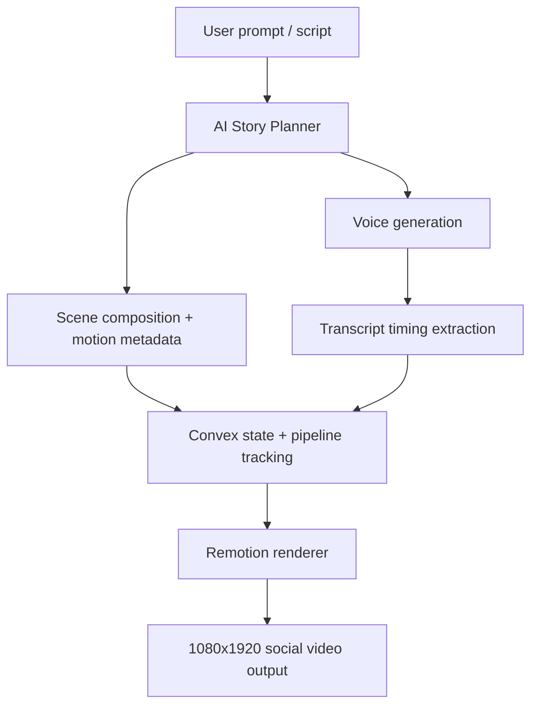

<div align="center">

# 🎬 Vox Reel Engine 2.5D

### AI-powered motion graphic reel studio for documentary-style short-form video

[](https://nextjs.org/)
[](https://remotion.dev/)
[](https://convex.dev/)
[](https://clerk.com/)
[](https://deepgram.com/)
[](https://ai.google.dev/)


<p align="center">
  <b>Turn a prompt, a story, or a script into cinematic vertical reels with layered motion, kinetic captions, and AI-generated narration.</b>
</p>

</div>

---

## Overview

Vox Reel Engine is a full-stack content studio for creating high-retention social videos in a documentary-inspired 2.5D style. The product combines:

- AI-driven scripting and scene planning
- Voice generation and transcript timing
- Real-time state tracking with Convex
- Remotion-based rendering for frame-accurate video output
- Editorial motion templates inspired by premium documentary storytelling

This project is designed for creators, agencies, and teams who want a faster path from idea to polished short-form video.

## What’s New

Recent updates in this project include:

- Interactive landing experience with motion-driven product storytelling
- 2.5D documentary visual language with layered parallax and paper-cut styling
- Real-time reel generation pipeline with live status updates
- Multi-step AI flow for script, narration, and scene composition
- Cloud rendering bundle support for Modal-based Remotion rendering
- Social-first showcase sections and creator-facing product UX improvements

## Key Features

- 🎭 2.5D depth compositions with layered motion and parallax motion design
- 🧠 AI orchestration for scene structure and script generation
- 🎙️ Voiceover synthesis and word-level timing extraction
- 🖼️ Editorial motion templates and cinematic overlays
- ⚡ React + Remotion pipeline for deterministic video rendering
- 🔄 Convex-powered real-time backend and live generation state
- 🔐 Clerk-based authentication and secure app flow
- 📦 Cloud render support via the Modal rendering bundle

## Architecture



The system is organized as a frontend + backend + rendering pipeline:

1. The user creates content or provides a prompt in the Next.js app.
2. AI models generate the narrative and sequencing structure.
3. Voice and timing services create synchronized audio and captions.
4. Convex stores the reel state and pushes updates to the client in real time.
5. Remotion renders the final motion-graphic composition.

## Tech Stack

| Area | Technologies |
| :--- | :--- |
| App framework | Next.js 16, React 19 |
| Video engine | Remotion 4.0, @remotion/player, @remotion/transitions |
| Backend | Convex |
| Auth | Clerk |
| AI / speech | Gemini 2.5, Deepgram, Cartesia |
| Styling / motion | Tailwind CSS, GSAP, Framer Motion |
| Background jobs | Inngest |
| Cloud rendering | Modal + Remotion bundle |

## Repository Structure

```text
motion-graphic-reel/
├── convex/                  # Convex backend, schema, and server logic
├── modal_render/            # Modal deployment bundle for Remotion rendering
├── public/                  # Assets and README visuals
├── scripts/                 # Utility scripts
├── src/
│   ├── app/                 # Next.js app router pages and routes
│   ├── components/          # Reusable UI and motion blocks
│   ├── lib/                 # Shared utilities
│   ├── inngest/             # Background job handlers
│   └── remotion/            # Remotion scenes and templates
├── package.json
├── next.config.*
├── tsconfig.json
├── README.md
└── LICENSE
```

## Getting Started

### Prerequisites

- Node.js 20+
- npm / pnpm / yarn
- Git
- Access to required AI / speech / auth provider credentials

### 1) Clone the repository

```bash
git clone https://github.com/mritunjay226/motion-graphic-reel.git
cd motion-graphic-reel
```

### 2) Install dependencies

```bash
npm install
```

### 3) Configure environment variables

Create a `.env.local` file in the project root and add the required values for your local environment. Example:

```env
# Core app / Convex
NEXT_PUBLIC_CONVEX_URL=https://your-deployment.convex.cloud
CONVEX_DEPLOYMENT=dev:your-deployment-id
NEXT_PUBLIC_CONVEX_SITE_URL=https://your-deployment.convex.site

# Clerk auth
NEXT_PUBLIC_CLERK_PUBLISHABLE_KEY=pk_test_...
CLERK_SECRET_KEY=sk_test_
CLERK_JWT_ISSUER_DOMAIN=https://your-domain.clerk.accounts.dev

# AI & speech
GEMINI_API_KEY=your_gemini_key
DEEPGRAM_API_KEY=your_deepgram_key
CARTESIA_API_KEY=your_cartesia_key
OPENROUTER_API_KEY=your_openrouter_key

# Asset / image services
NEXT_PUBLIC_IMAGEKIT_URL_ENDPOINT=https://ik.imagekit.io/your_imagekit_id
IMAGEKIT_PUBLIC_KEY=your_imagekit_public_key
IMAGEKIT_PRIVATE_KEY=your_imagekit_private_key

# Inngest
INNGEST_EVENT_KEY=your_inngest_event_key
INNGEST_SIGNING_KEY=your_inngest_signing_key
```

> The exact variable set can vary depending on your deployment and integrations. Use the keys required by your environment and keep secrets out of source control.

### 4) Start the Convex backend

```bash
npx convex dev
```

### 5) Start the background job worker

```bash
npx inngest-cli@latest dev
```

### 6) Run the app

```bash
npm run dev
```

Then open:

```text
http://localhost:3000
```

## Scripts

```bash
npm run dev
npm run build
npm run start
npm run sync:modal
```

## Project Notes

This repository focuses on providing a polished studio experience for short-form video generation, placing emphasis on:

- script-to-video workflows
- motion-heavy editorial storytelling
- real-time creator feedback
- scalable video rendering pipelines

## License

This project is licensed under the MIT License. See the [LICENSE](LICENSE) file for details.

---

<div align="center">
  <sub>Built for creators who want to turn ideas into cinematic vertical stories.</sub>
</div>
