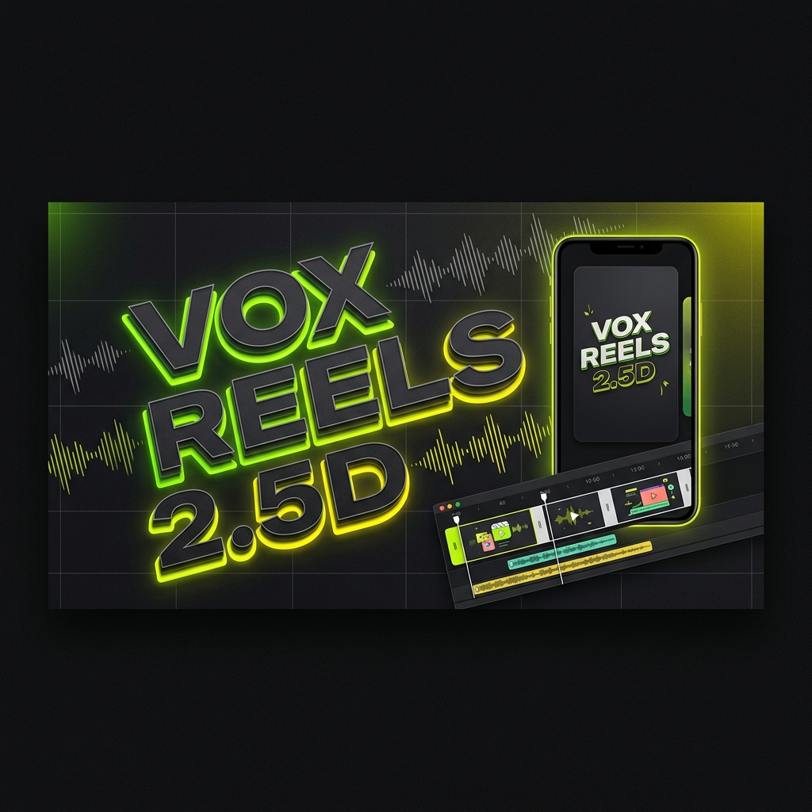
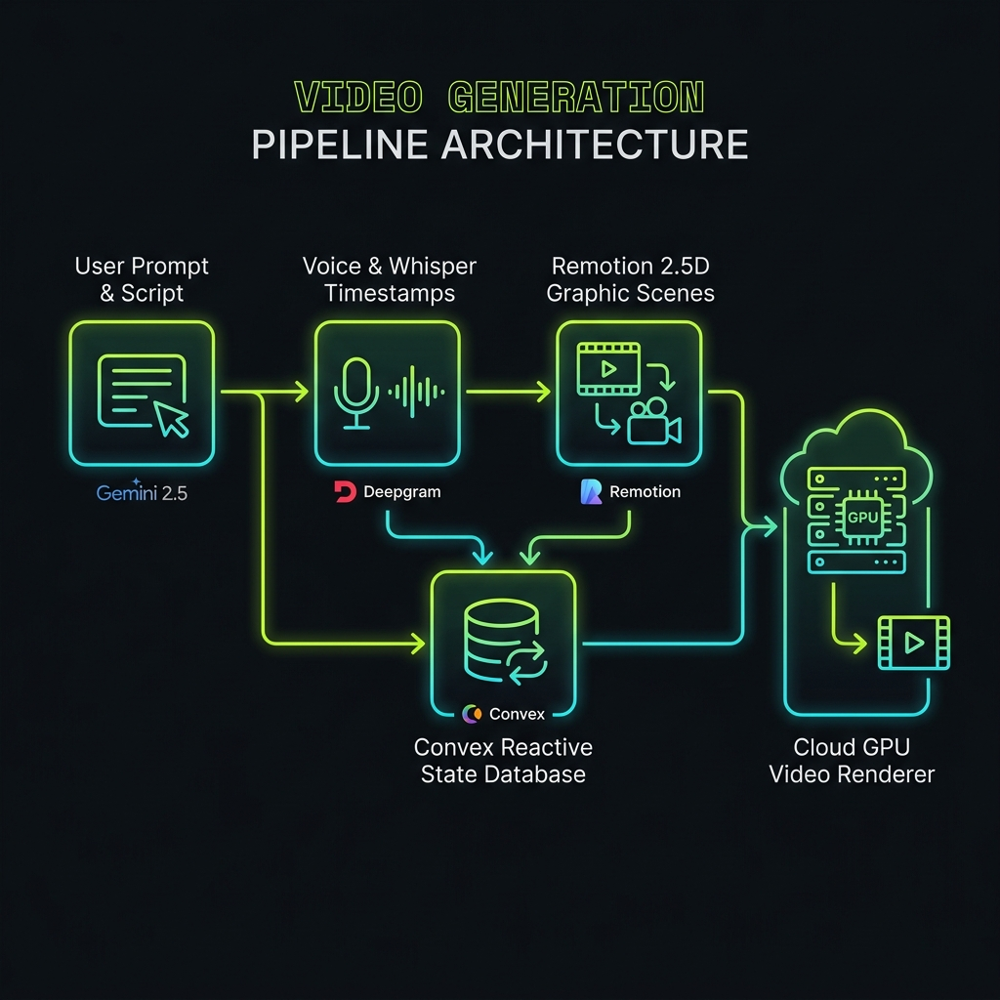
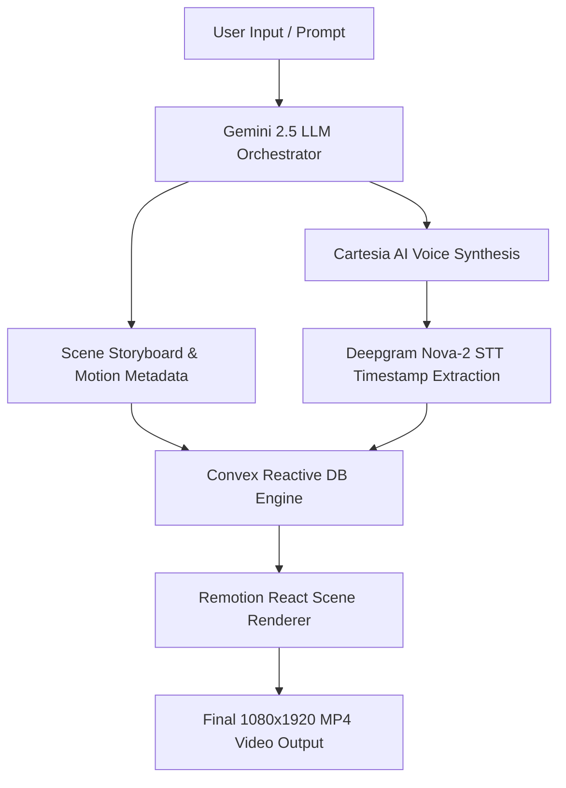
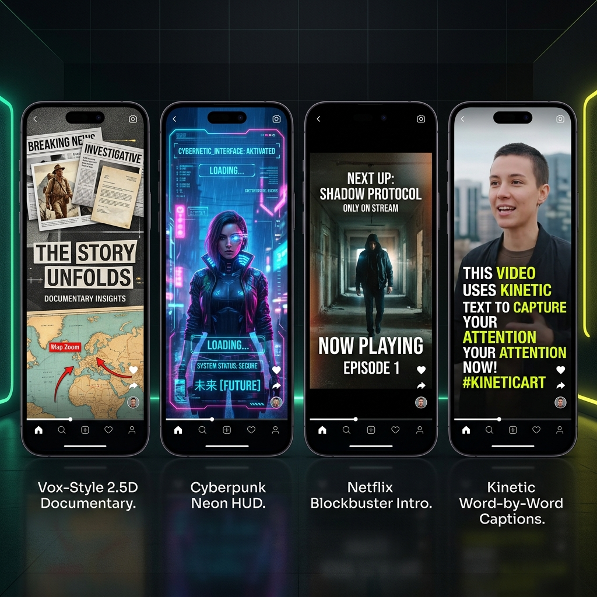

<div align="center">

# 🎬 VOX REEL ENGINE 2.5D
### *AI-Powered Motion Graphic & Short-Form Reel Generator*

[](https://nextjs.org/)
[](https://remotion.dev/)
[](https://convex.dev/)
[](https://clerk.com/)
[](https://deepgram.com/)
[](https://ai.google.dev/)
[](https://greensock.com/gsap/)

<br />



<p align="center">
  <b>Transform simple prompts and scripts into high-retention 2.5D documentary-style video reels in seconds.</b><br />
  Designed for 9:16 vertical short-form content (1080x1920 @ 30 FPS) with dynamic depth parallax, kinetic word captions, archival paper cutouts, and broadcast film overlays.
</p>

---

[Features](#-key-features) • [Architecture](#-system-architecture) • [Templates](#-motion-templates) • [Getting Started](#-getting-started) • [Environment Variables](#-environment-variables) • [Tech Stack](#-tech-stack)

</div>

<br />

## 🌟 Overview

**Vox Reel Engine 2.5D** is a full-stack SaaS platform built to automate the creation of high-impact, editorial short-form reels—styled after iconic YouTube documentary channels like *Vox*, *Johnny Harris*, and *Magnolia*. 

By combining LLM script orchestration, real-time voice synthesis, word-level audio synchronization, and Remotion React compositions, Vox Reel Engine produces studio-grade motion graphics complete with continuous subject wiggles, retro film grain, map zooms, and dynamic lower-thirds.

<br />

## 🚀 Key Features

- 🎭 **2.5D Parallax & Subject Cutouts**: Automatic background/foreground layer separation with continuous subtle scale-drifts, wiggles, and paper textures.
- ⚡ **Autonomous AI Pipeline**: Prompt-to-video workflow powered by **Gemini 2.5** (script & scene generation), **Cartesia AI** (voice synthesis), and **Deepgram Nova-2** (word-level timestamp sync).
- 🎬 **Remotion React Composition Engine**: Frame-accurate video generation in React utilizing `@remotion/player`, `@remotion/transitions`, and serverless cloud rendering capabilities.
- 🔄 **Real-Time Reactive State**: Powered by **Convex DB** for instant mutations, reactive queries, and live status updates during multi-stage video generation pipelines.
- 💬 **Kinetic Word-by-Word Captions**: Subtitle engine driven by precise audio timestamps, smooth spring physics, and customizable highlight colors.
- 📼 **Broadcast Film Treatments**: Integrated `<FilmTreatment />` overlay engine delivering realistic film grain, CRT scanlines, lens vignetting, and viewport gridlines.
- 🔐 **Secure Authentication**: Built-in user identity management using **Clerk**.

<br />

## 🏗️ System Architecture



The creation pipeline operates asynchronously across specialized service nodes:



1. **Scripting & Scene Orchestration**: Gemini 2.5 translates the topic into structured scene beats, visual prompt instructions, map targets, and narration.
2. **Audio & Speech Sync**: Voiceover audio is generated, and Deepgram Nova-2 extracts exact millisecond-level word timing (`whisperTokens`).
3. **Reactive Persistence**: Convex updates pipeline state and streams status updates live to the Next.js frontend UI.
4. **Remotion Composition**: Remotion evaluates each frame, executing spring physics, layer parallax, and captions in total sync with the audio track.

<br />

## 🎨 Motion Templates



| Template | Aesthetic | Key Visual Elements |
| :--- | :--- | :--- |
| 📰 **Vox 2.5D Cutout** | Editorial / Archival | Paper clippings, vintage texture maps, yellow highlight markers, parallax depth |
| 🏙️ **Cyberpunk Neon** | Futuristic / High-Tech | Electric HUD grid overlays, glowing cyan text scanners, matrix data counters |
| 🍿 **Netflix Blockbuster** | Cinematic Documentary | Deep dark background, atmospheric film grain, cinematic zoom titles, letterboxing |
| 📊 **Kinetic Data Viz** | Financial & Explainer | Smooth animated counters, chart bar reveals, motion lower-thirds, pop audio triggers |

<br />

## 🛠️ Getting Started

### Prerequisites

Ensure you have the following tools installed on your system:
- **Node.js**: `v20.0.0` or higher
- **npm** / **pnpm** / **yarn**
- **Git**

### Installation

1. **Clone the Repository**:
   ```bash
   git clone https://github.com/mritunjay226/motion-graphic-reel.git
   cd motion-graphic-reels
   ```

2. **Install Dependencies**:
   ```bash
   npm install
   ```

3. **Set Up Environment Variables**:
   Copy `.env.example` to `.env.local` and configure your API keys:
   ```bash
   cp .env.example .env.local
   ```

4. **Initialize Convex Backend**:
   ```bash
   npx convex dev
   ```

5. **Start Inngest Dev Server**:
   ```bash
   npx inngest-cli@latest dev
   ```

6. **Launch Development Application**:
   ```bash
   npm run dev
   ```

7. **Open Application**:
   Navigate to [http://localhost:3000](http://localhost:3000) in your browser.

<br />

## 🔑 Environment Variables

Required environment configuration keys in `.env.local`:

```ini
# Voice & AI Services
CARTESIA_API_KEY=your_cartesia_api_key
DEEPGRAM_API_KEY=your_deepgram_api_key
OPENROUTER_API_KEY=your_openrouter_api_key
GEMINI_API_KEY=your_gemini_api_key

# Image CDN & Asset Optimization
NEXT_PUBLIC_IMAGEKIT_URL_ENDPOINT=https://ik.imagekit.io/your_imagekit_id
IMAGEKIT_PUBLIC_KEY=your_imagekit_public_key
IMAGEKIT_PRIVATE_KEY=your_imagekit_private_key

# Convex Realtime Backend
CONVEX_DEPLOYMENT=dev:your-deployment-id
NEXT_PUBLIC_CONVEX_URL=https://your-deployment.convex.cloud
NEXT_PUBLIC_CONVEX_SITE_URL=https://your-deployment.convex.site

# Clerk Authentication
NEXT_PUBLIC_CLERK_PUBLISHABLE_KEY=pk_test_...
CLERK_SECRET_KEY=sk_test_...
CLERK_JWT_ISSUER_DOMAIN=https://your-domain.clerk.accounts.dev

# Inngest Background Pipeline
INNGEST_EVENT_KEY=your_inngest_event_key
INNGEST_SIGNING_KEY=your_inngest_signing_key
```

<br />

## 📁 Repository Structure

```
motion-graphic-reels/
├── convex/                  # Convex backend schemas, functions, and pipeline mutations
│   ├── schema.ts            # Type-safe database validation schema
│   ├── reels.ts             # Reel CRUD and generation queries
│   └── pipeline.ts          # Video generation pipeline logic
├── src/
│   ├── app/                 # Next.js 16 App Router (pages, APIs, auth routes)
│   │   ├── create-video/    # Interactive AI prompt studio page
│   │   ├── reel/[id]/       # Reel playback, preview & export workspace
│   │   └── page.tsx         # High-converting landing page with 2.5D preview
│   ├── components/          # Reusable UI & landing page components
│   ├── remotion/            # Remotion compositions, compositions registry & templates
│   │   ├── components/      # FilmTreatment, WordCaptions, ParallaxLayer, etc.
│   │   └── SceneRenderer.tsx# Dynamic scene player & keyframe animator
│   ├── inngest/             # Inngest background event handlers
│   └── lib/                 # Client utilities and helpers
├── public/                  # Static assets & README media graphics
└── package.json             # App dependencies & scripts
```

<br />

## 💻 Tech Stack

| Category | Technology |
| :--- | :--- |
| **Framework** | Next.js 16 (App Router, React 19) |
| **Video Engine** | Remotion 4.0 (`@remotion/player`, `@remotion/transitions`, `@remotion/cli`) |
| **Backend & DB** | Convex 1.43 (Real-time reactivity, mutations, queries) |
| **Authentication** | Clerk (`@clerk/nextjs` with `proxy.ts`) |
| **Speech & Audio** | Cartesia AI (Voiceover), Deepgram Nova-2 SDK (Whisper STT timestamps) |
| **AI LLM** | Google Gemini 2.5 / OpenRouter |
| **Styling & Motion** | Tailwind CSS v4, GSAP (`@gsap/react`), Framer Motion 13 |
| **Background Tasks**| Inngest Queue Pipeline |

<br />

## 📜 License

This project is licensed under the MIT License - see the [LICENSE](LICENSE) file for details.

<hr />

<div align="center">
  <sub>Built with ❤️ for Creators and Motion Designers by the Vox Reel Engine Team.</sub>
</div>

